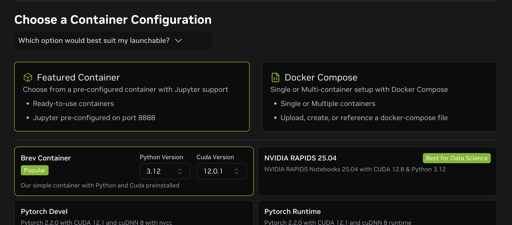

# Create a Launchable from Your Agent
 

Ready to make your AI agent easily runnable by others? Let's turn your GitHub repository into a Brev launchable so others can use it!

A **Launchable** is a shareable, one-click way to run any AI workflow or application. Think of it as a "Deploy to Cloud" button for your AI projects. Launchables pair your code with the exact hardware it needs (GPUs, memory, etc.), package all dependencies, and let anyone run your agent on their own account without having to set up environments or install anything.

## Prerequisites

Before creating a launchable, make sure you have:
- A public Github repo
- Your agent code [published to GitHub](github_workflow.md)

<!-- fold:break -->

## Step 1: Open the Launchable Creator

The fastest way to share any AI Workflow is by creating a Launchable.

Launchables allow you pair your code up with the hardware it needs to run. 
You can then share your Launchable so anyone can run it on their own account.

To get started making your own launchable, open the [Brev Console](https://brev.nvidia.com/launchables/create) and sign in.  

<!-- fold:break -->

## Step 2: Connect Your Repository

- Select: `I have my files in a git repository` 
- Enter the URL to your forked repository: `https://github.com/YOUR_USERNAME/workshop-build-an-agent.git`
- Select `With container(s)` for the runtime environment

<!-- fold:break -->

## Step 3: Choose Your Environment

- Select `Featured Container` to use a pre-configured container
- Use the `Brev Container` and select a Python Version of `3.12`

<!-- fold:break -->

## Step 4: Configure Applications & Hardware

Click Next to confirm that Jupyter will be the only application by default.

On the next page, select the appropriate GPU profile.

<!-- fold:break -->

## Step 5: Name and Create Your Launchable

Give your Launchable a name and create it! This will give you a public link to your Launchable. Share it with everyone!

