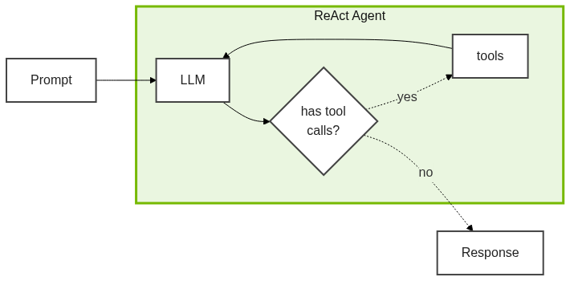
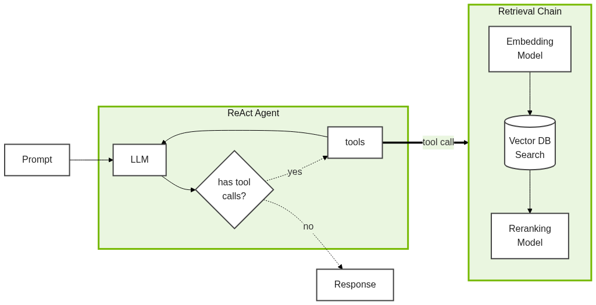

# Agentic Retrieval Augmented Generation

## Introduction to RAG

The simplest method for interacting with LLMs is directly prompting them and allowing the model to provide a response.

<center>


</center>

<!-- fold:break -->

Retrieval augmented generation (RAG) is a useful technique that improves accuracy of LLMs by providing them with additional context at inference time. Typically, this data is recalled from a custom Vector Database.

<center>


</center>

<!-- fold:break -->

## Upscale with Agents

RAG works well, but it has limits. The LLM can't control how data is retrieved or choose between different data sources. It always runs the same retrieval step, making it hard to scale or support multiple datasets.

Agentic RAG solves these problems by letting the model decide when and how to use retrieval as a tool. The model can choose to look up information only when it needs more context to answer a question.

<!-- fold:break -->

## ReAct Agent Architecture

ReAct Agents are a simple agentic architecture that add tool calling support to traditional LLMs. We will use this to build our RAG Agent.

The prompt is provided to the LLM. If the model requests any tool calls, those tools will be run, added to the chat history, and sent back to the model to be invoked again. When no tools are requested, the model's response is sent back.

<center>



</center>

<!-- fold:break -->

## Agentic RAG Architecture

To make a ReAct Agent do RAG, just give it the Retrieval Chain as a tool. The agent can then decide when and how to search for information.

You can also add more tools for different data sources if needed. This makes your architecture more flexible.

<center>



</center>

<!-- fold:break -->

## Let's Build

Let's build an IT Help Desk agent that can answer basic user queries by querying the Knowledge Base. A knowledge base has been provided at `./data/it-knowledge-base`. This directory contains markdown files documenting procedures for Company LLC.

<button onclick="openOrCreateFileInJupyterLab('code/rag_agent.py');"><i class="fa-brands fa-python"></i> code/rag_agent.py</button> is an initial layout for our agent's code. We will be using LangGraph's built-in classes to connect NVIDIA models and create our agent.

<!-- fold:break -->

### Agent Config and Setup

After the initial imports, our code starts by defining configuration and loading data sets.

<button onclick="goToLineAndSelect('code/rag_agent.py', '# Data Ingestion Configuration');"><i class="fas fa-code"></i> # Data Ingestion Configuration</button> defines the knowledge base path and the chunking parameters. More on those later.

<button onclick="goToLineAndSelect('code/rag_agent.py', '# Model Configuration');"><i class="fas fa-code"></i> # Model Configuration</button> specifies which models to use for each step.

Finally, <button onclick="goToLineAndSelect('code/rag_agent.py', '# Read the data');"><i class="fas fa-code"></i> # Read the data</button> reads the knowledge base markdown files.

<!-- fold:break -->

### Create a Vector Database

For now, we will use an in memory [FAISS](https://faiss.ai/index.html) database. This is an efficient way to spin up small databases for development.

When loading documents for an LLM, it is best to split those documents into multiple chunks. For best recall, it is also beneficial for these chunks to overlap each other. The size of these chunks and the amount of overlap were defined above as `CHUNK_SIZE` and `CHUNK_OVERLAP`. Define <button onclick="goToLineAndSelect('code/rag_agent.py', 'splitter = ');"><i class="fas fa-code"></i> splitter</button> using these values and LangGraph's [`RecursiveCharacterTextSplitter`](https://python.langchain.com/docs/how_to/recursive_text_splitter/).

<details>
<summary>🆘 Need some help?</summary>

```
splitter = RecursiveCharacterTextSplitter(
    chunk_size=CHUNK_SIZE, chunk_overlap=CHUNK_OVERLAP
)
```

</details>

<!-- fold:break -->

These chunks need to be embedded into vectors for the database. This is  done with the `RETRIEVER_EMBEDDING_MODEL` defined before.

Use the [NVIDIAEmbeddings](https://build.nvidia.com/nvidia/llama-3_2-nv-embedqa-1b-v2?snippet_tab=LangChain) class to define <button onclick="goToLineAndSelect('code/rag_agent.py', 'embeddings = ');"><i class="fas fa-code"></i> embeddings</button>. The API Key has already been configured, it does not need to be specified. Set truncate to `END`.

<details>
<summary>🆘 Need some help?</summary>

```
embeddings = NVIDIAEmbeddings(
    model=RETRIEVER_EMBEDDING_MODEL,
    truncate="END"
)
```

</details>

<!-- fold:break -->

With our processed documents and embedding model, we can define <button onclick="goToLineAndSelect('code/rag_agent.py', 'vectordb = ');"><i class="fas fa-code"></i> vectordb</button>.

<!-- fold:break -->

### Create the Retrieval Chain

LangChain allows us to easily create a basic retrieval chain from our Vector Database object. This was done to define <button onclick="goToLineAndSelect('code/rag_agent.py', 'kb_retriever = ');"><i class="fas fa-code"></i> kb_retriever</button>. This chain will have the embedding step and the lookup step.

<!-- fold:break -->

NVIDIA offers a Reranker model to improve the relevance and order of retrieved documents. Use the [NVIDIARerank](https://build.nvidia.com/nvidia/llama-3_2-nv-rerankqa-1b-v2?snippet_tab=LangChain) class to define <button onclick="goToLineAndSelect('code/rag_agent.py', 'reranker = ');"><i class="fas fa-code"></i> reranker</button>.

<details>
<summary>🆘 Need some help?</summary>

```
reranker = NVIDIARerank(model=RETRIEVER_RERANK_MODEL)
```

</details>

<!-- fold:break -->

To further improve the quality of retrieved documents, we can chain our retriever with a reranker using LangChain’s <button onclick="goToLineAndSelect('code/rag_agent.py', '= ContextualCompressionRetriever');"><i class="fas fa-code"></i>ContextualCompressionRetriever</button>. This ensures that the most relevant results are surfaced to the agent.

Next, we expose this enhanced retrieval pipeline as a tool for the agent using LangGraph’s <button onclick="goToLineAndSelect('code/rag_agent.py', '= create_retriever_tool');"><i class="fas fa-code"></i> create_retriever_tool</button>. The `name` and `description` fields help the agent decide when to use this tool during multi-step reasoning.

<!-- fold:break -->

### Create the Agent

Every agent uses an LLM  for decision making and communicating. For this example, we will be using NVIDIA's Nemotron Nano model. These models represent a tuned balance of speed, cost, and accuracy.

The LLM model name was defined in `LLM_MODEL`. Use this and the [ChatNVIDIA](https://python.langchain.com/docs/integrations/chat/nvidia_ai_endpoints/#instantiation) class to define <button onclick="goToLineAndSelect('code/rag_agent.py', 'llm =');"><i class="fas fa-code"></i> llm</button>.

<details>
<summary>🆘 Need some help?</summary>

```
llm = ChatNVIDIA(model=LLM_MODEL)
```

</details>

A system prompt has been defined in the code. Feel free to review it.

<!-- fold:break -->

Becuase the ReAct architecture is so common, LangGraph provides a function that will create ReAct agent graphs. Plug `llm`, `RETRIEVER_TOOL`, and `SYSTEM_PROMPT` into LangGraph's [`create_react_agent`](https://langchain-ai.github.io/langgraph/agents/agents/#2-create-an-agent). Assign the resulting value to <button onclick="goToLineAndSelect('code/rag_agent.py', 'AGENT =');"><i class="fas fa-code"></i> AGENT</button>.

<details>
<summary>🆘 Need some help?</summary>

```
AGENT = create_react_agent(
    model=llm,
    tools=[RETRIEVER_TOOL],
    prompt=SYSTEM_PROMPT,
)
```

</details>

<!-- fold:break -->

## Run Your Agent

<button onclick="openNewTerminal();"><i class="fas fa-terminal"></i> terminal</button>

## Use Local NIMs